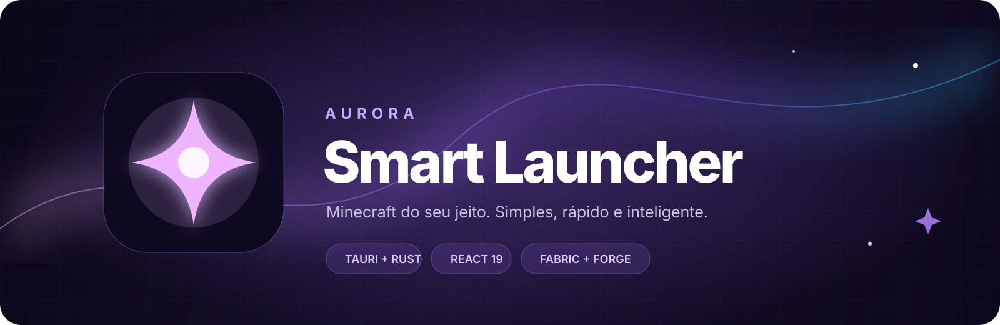
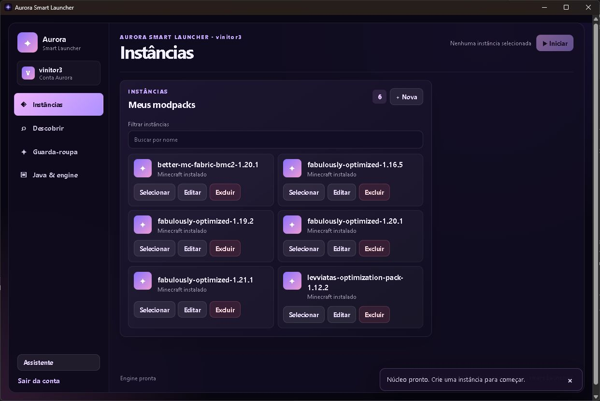
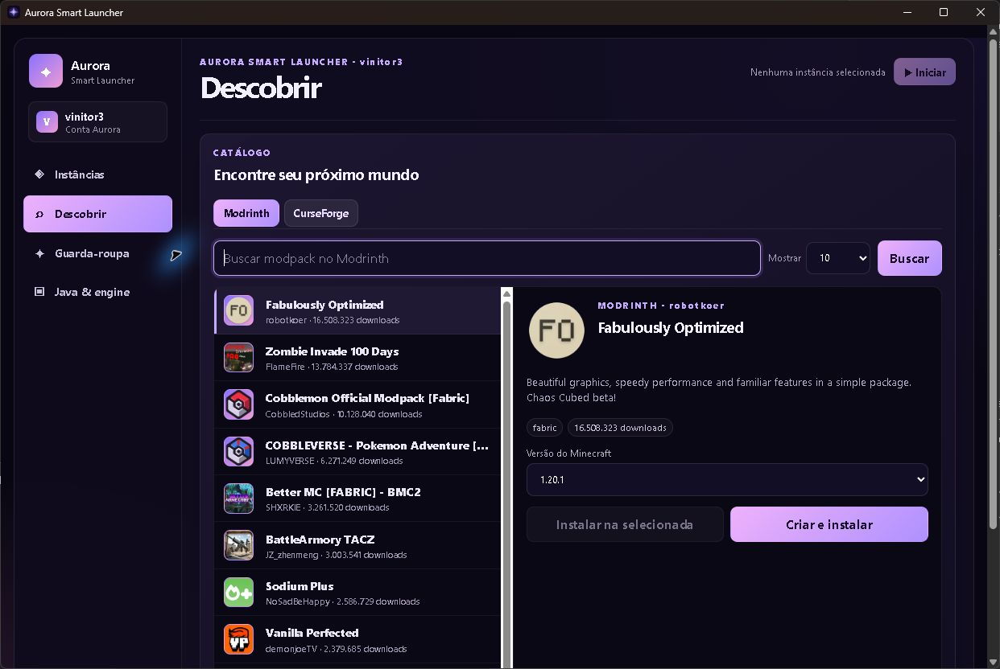
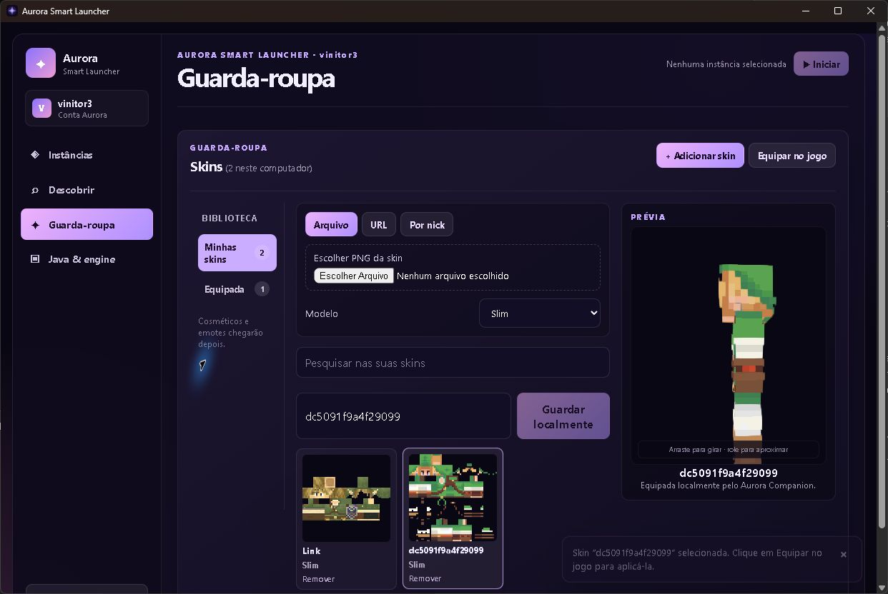
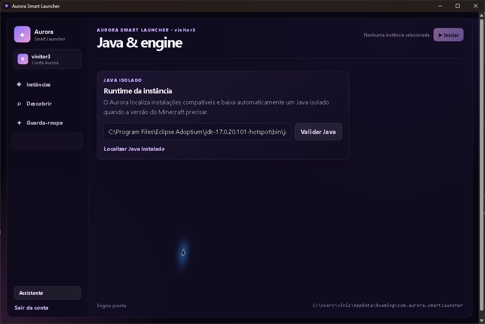
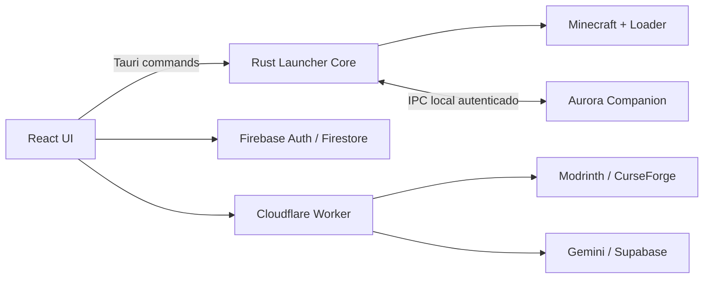

<p align="center">
  
</p>

<p align="center">
  <strong>Seu universo Minecraft, organizado em um launcher rápido, inteligente e feito para ser seu.</strong>
</p>

<p align="center">
  
  
  
  
  
</p>

<p align="center">
  <a href="https://github.com/vinitor3/AuroraLauncher/releases/latest"></a>
</p>

> [!IMPORTANT]
> O Aurora está em **alpha privada**. O launcher já instala e executa instâncias, mas alguns recursos do Companion ainda aguardam homologação dentro do Minecraft. Consulte o [status técnico](docs/phase-0-status.md) antes de tratar uma combinação como validada.

## ✦ O que é o Aurora?

O **Aurora Smart Launcher** é um launcher independente para Minecraft Java Edition. Ele reúne instâncias isoladas, descoberta de modpacks, gerenciamento de conteúdo, skins, runtimes Java e um assistente integrado em uma experiência desktop única.

O projeto combina uma interface em **React**, um aplicativo **Tauri v2**, um núcleo de lançamento em **Rust**, serviços protegidos na edge e um **Companion** para integração com o jogo.

## Uma experiência completa

| Instâncias | Descoberta de modpacks |
|:--:|:--:|
|  |  |
| Instâncias isoladas, seleção rápida e acesso à configuração. | Catálogos Modrinth e CurseForge dentro do próprio launcher. |

| Guarda-roupa | Java & engine |
|:--:|:--:|
|  |  |
| Biblioteca local, busca por nick, favoritos e prévia 3D interativa. | Detecção, validação e provisionamento de Java por versão. |

## Recursos disponíveis

- **Contas Aurora:** cadastro e login por nick com Firebase Auth e perfis no Firestore.
- **Instâncias isoladas:** criação, edição, exclusão e inicialização sem misturar mundos, mods ou configurações.
- **Minecraft e loaders:** suporte a Vanilla, Fabric e Forge com resolução automática de dependências.
- **Java gerenciado:** detecção de runtimes compatíveis e download de um Java isolado quando necessário.
- **Modpacks e conteúdo:** pesquisa e instalação por Modrinth e CurseForge.
- **Gerenciador de downloads:** até oito transferências concorrentes, retomada, tentativas, hashes e publicação atômica.
- **Conteúdo por instância:** mods, shaders e resource packs com seleção múltipla, ativação, desativação e remoção.
- **Guarda-roupa:** skins locais, favoritos, busca por nick, modelo Classic/Slim, capa e visualização 3D.
- **Aurora Companion:** builds para Forge 1.12.2 e Fabric/Forge 1.16.5, 1.19.2, 1.20.1 e 1.21.1.
- **Assistente integrado:** conversa autenticada com Gemini, entrada por texto/voz, Edge TTS e legendas.
- **IPC seguro:** comunicação local via WebSocket em `127.0.0.1`, porta efêmera e nonce renovado a cada execução.

## Roadmap

| Etapa | Estado | Entrega |
| --- | :---: | --- |
| Fundação e identidade | ✅ | Tauri + React, núcleo Rust, autenticação, instâncias e instalador Windows |
| Launcher 1.1 | 🟣 | Downloads concorrentes, seleção múltipla, fluxo CurseForge e estabilização |
| Companion 1.2 | 🟡 | IPC, assistente, TTS e aparência implementados; homologação visual em andamento |
| Interface nativa in-game | ⏳ | Substituir a janela externa por tela/HUD nativos nas combinações suportadas |
| Atualizações de conteúdo | ⏳ | Detectar e atualizar mods e modpacks preservando versão e loader |
| Cosméticos e emotes | 🔭 | Expandir o guarda-roupa e a integração com o Companion |
| Distribuição estável | 🔭 | Atualizador do launcher, releases assinadas e canal público estável |

O detalhamento e as evidências de validação ficam em [`docs/phase-0-status.md`](docs/phase-0-status.md) e [`docs/ROADMAP.md`](docs/ROADMAP.md).

## Arquitetura



```text
AuroraLauncher/
├── apps/
│   ├── desktop/        # React + Tauri + núcleo Rust
│   ├── companion-mod/  # Companion Fabric e Forge
│   └── edge-proxy/     # API protegida na Cloudflare
├── firebase/           # Regras de Firestore e Storage
├── functions/          # Funções Firebase
├── releases/           # Instalador e JARs embarcados
├── scripts/            # Smoke tests e validações
└── docs/               # Arquitetura, integrações e homologação
```

## Desenvolvimento local

### Pré-requisitos

- Windows 10/11;
- Node.js 20+ e npm;
- Rust estável com Cargo;
- WebView2;
- JDK 8, 17 e 21 para trabalhar com toda a matriz do Companion.

### Launcher desktop

```powershell
cd apps/desktop
npm install
Copy-Item .env.example .env.local
npm run tauri dev
```

Preencha `.env.local` somente com a configuração pública do Firebase e a URL do Worker. Chaves privadas de Gemini, CurseForge e Supabase pertencem aos secrets do backend e **não** devem entrar no aplicativo.

### Verificações

```powershell
npm --prefix apps/desktop run build
cargo test --manifest-path apps/desktop/src-tauri/Cargo.toml
npm --prefix apps/edge-proxy run check
npm --prefix functions run lint
```

Para gerar os Companions:

```powershell
npm run companion:build
```

## Segurança e privacidade

- Tokens Firebase e nonces de sessão nunca são registrados pelo núcleo.
- Segredos de serviços permanecem no Worker/Functions, nunca no bundle desktop.
- O Companion aceita conexões somente no loopback local.
- A análise de tela é opcional e exige confirmação explícita a cada captura.
- Vulnerabilidades devem seguir o processo descrito em [`SECURITY.md`](SECURITY.md).

## Documentação

- [Status e homologação](docs/phase-0-status.md)
- [Roadmap do produto](docs/ROADMAP.md)
- [Launcher Core](docs/module-a.md)
- [IPC do Companion](docs/companion-ipc.md)
- [Backend CurseForge](docs/curseforge-backend.md)
- [Configuração do Firebase](docs/firebase-setup.md)
- [Armazenamento de aparências](docs/supabase-storage.md)
- [Avisos de terceiros](THIRD_PARTY_NOTICES.md)

## Aviso legal

Aurora Smart Launcher é um projeto independente e não é afiliado à Mojang Studios, Microsoft, Modrinth, CurseForge ou Google. Minecraft e suas marcas pertencem aos respectivos titulares. A distribuição deve respeitar as licenças e os termos dos jogos, loaders, mods e serviços integrados.

<p align="center">
  <sub>Feito com Rust, React e uma boa dose de luz roxa. ✦</sub>
</p>
