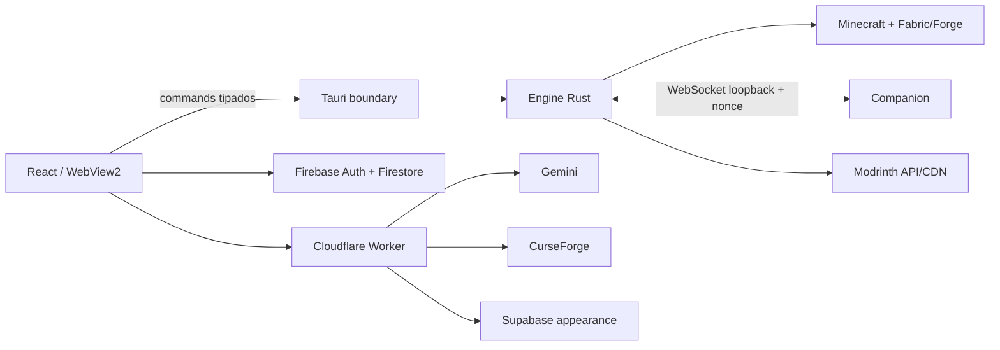
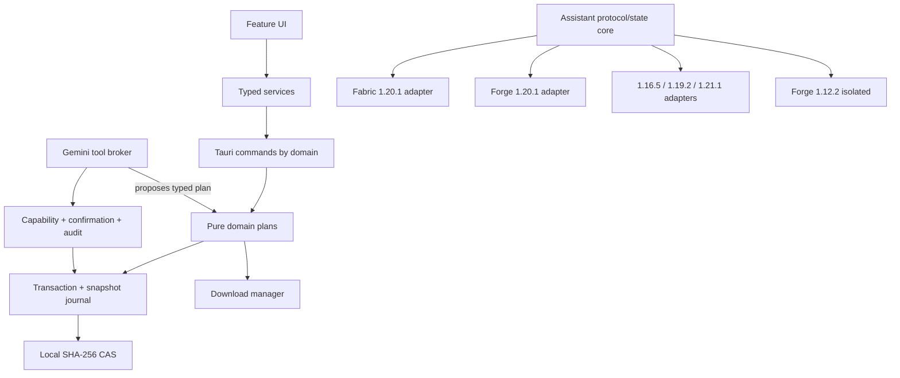

# Architecture Review

## Arquitetura atual confirmada

O desenho é adequado para o alpha: secrets permanecem fora do cliente, o jogo não recebe JWT e a engine local controla caminhos/processos. As fragilidades não exigem reescrita: exigem limites mais nítidos, módulos menores e transações antes de automação.

## Fronteiras a corrigir

| Fronteira | Estado | Evolução |
| --- | --- | --- |
| `App.tsx` (2.293 linhas) | alto acoplamento | extrair features/serviços por comportamento; lazy-load de Discover/Wardrobe/Assistant |
| `commands.rs` (1.582 linhas) | domínio misturado | preservar nomes Tauri e mover implementação para módulos `commands/*` |
| Worker `index.ts` (456 linhas) | rotas e infraestrutura juntas | router fino + `auth`, `rate_limit`, `assistant`, `curseforge`, `appearance` |
| Companion Swing | protótipo externo | `assistant-core` independente + adaptadores de tela/render/input |
| metadados de conteúdo | provider-specific | inventário normalizado e plano de atualização puro antes de IO |
| mutações locais | sem transação geral | journal/snapshot mínimo; depois CAS SHA-256 + SQLite |

## Arquitetura alvo incremental

### Companion/HUD

Não haverá uma UI Java “universal” compilada cegamente para nove alvos. Compartilhar:

- DTOs IPC, máquina de estados, histórico, fila de legenda, limites e sanitização;
- view-model independente de classes Minecraft;
- testes de protocolo e estado.

Adaptar:

- registro de keybind e tick;
- `Screen`/render/HUD e captura de input;
- nomes/mappings das classes;
- registro de textura/skin/capa;
- ciclo de vida por loader.

O MVP Fabric 1.20.1 deve usar uma `Screen` cliente que sobrescreva `isPauseScreen()` para não pausar, com camada HUD separada para legendas. Forge 1.20.1 recebe adaptador equivalente. 1.12.2 permanece módulo isolado Java 8/LWJGL 2.

### Updater e CAS

1. Inventário imutável: provider, projectId, fileId, version, gameVersion, loader, hashes e dependências.
2. Resolver produz `UpdatePlan` sem tocar no disco: `SAFE`, `AMBIGUOUS`, `BLOCKED`.
3. Executor cria snapshot/journal, baixa para staging, valida e troca por rename.
4. Rollback reaplica manifesto anterior.
5. CAS futuro: `blobs/sha256/aa/<digest>`, manifesto versionado e índice SQLite transacional. GC apenas remove blobs não alcançáveis por instância/snapshot retido.

### Gemini Tools

O modelo propõe chamadas; nunca executa. O broker valida schema, capability, raiz de caminho, precondição e orçamento. Níveis 0/1 podem começar após parser/Doctor somente leitura. Nível 2 exige diff + snapshot + confirmação. Nível 3 fica adiado.

### Master e multiplayer

Master só começa depois de manifesto v3, roles e auditoria. Multiplayer separa descoberta/convite, autenticação de sessão e transporte. O IPC local nunca vira canal remoto. O primeiro experimento mede e4mc e World Host sem acoplar Aurora a relay próprio.

## Princípios

- Planos puros antes de efeitos colaterais.
- Identidade/autorização verificadas em toda fronteira, não confiadas ao modelo/UI.
- Toda escrita relevante tem staging, validação, commit e rollback.
- Compatibilidade é dado observado, não promessa de build.
- Custo zero significa limite rígido + modo degradado, nunca serviço ilimitado implícito.

