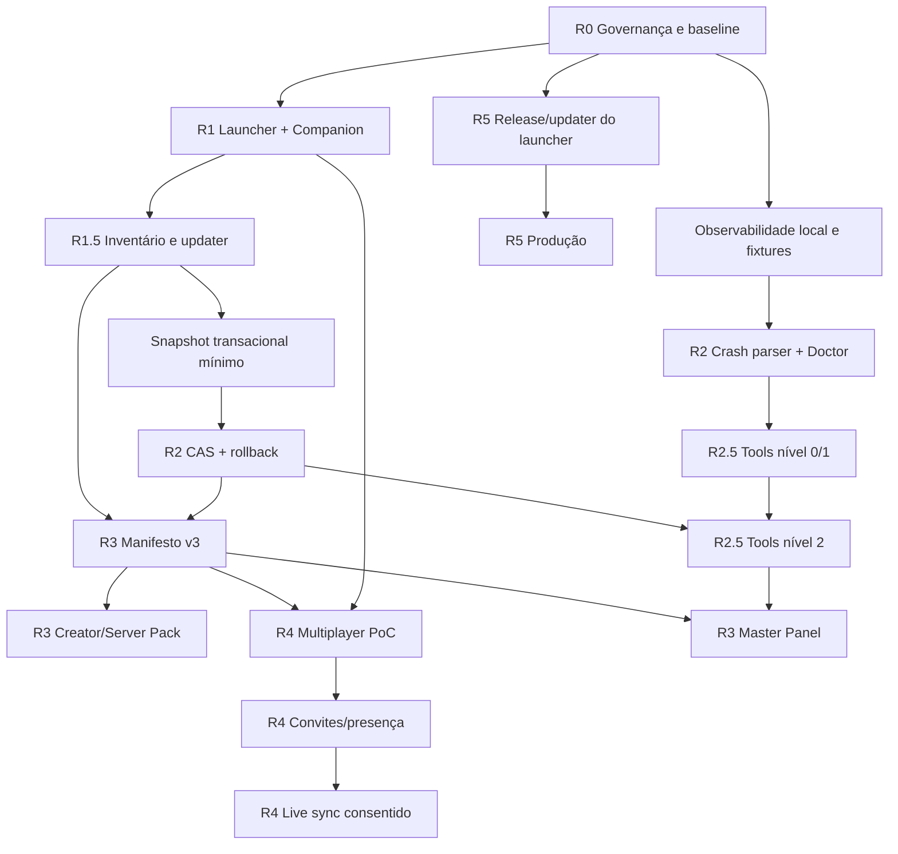

# Dependency Graph

## Trilho crítico

`R0 → R1 → inventário/updater → snapshot/CAS → Tools mutáveis → manifesto → multiplayer sync`.

## Paralelizável agora — Wave 0

- regras/testes Firestore em `firebase/**`;
- licença/avisos em arquivos jurídicos dedicados;
- CI em `.github/workflows/**`;
- proveniência, versionamento e documentação pública, sem substituir binários históricos.

## Próxima — Wave 1

- timeout HTTP/IPC sem tocar no frontend;
- harness runtime sem reescrever adaptadores;
- decomposição do `App.tsx` com ownership exclusivo;
- substituição transacional com staging/rollback em domínio Rust isolado.

## Bloqueado

- Tools nível 2 por falta de snapshot/rollback;
- live mod sync por falta de manifesto assinado e updater;
- Master por falta de APIs/roles/manifests estáveis;
- auto-updater por falta de chave de assinatura e política de canal.
- lançamento público por falta de prova Microsoft/Xbox/Minecraft de entitlement; Firebase identifica a conta Aurora, não a posse do jogo.

## Deve esperar

- relay Aurora próprio, social completo, analytics remoto, cosméticos pagos, nível 3 de IA e suporte NeoForge.
